# So welcome to the writeup/walkthrough of the harry potter theme based ctf

### Disclaimer: I have added the flags and hints in flags.txt and links to the websites in links.txt

## Flag 1:
So we get the website link which is https://ctf-49i.pages.dev/harry_1/  
Now When you do a inspect or do view page source you can see some comments written in the page. Now the main point here is that sometimes the developers keep their hard-coded passwords or usernames in the comment duirng the testing phase and forget to change it. This creates an attack vector. Now the comment hinting for `..`. `..` in linux is used to go back a direcotory so we can use that and go back a directory and get the super_secrete.txt. Again here developers keep unwanted directories hosted and in turn leak creds or info.

Now in the text file we get a prophecy made (if you have seen harry potter it might be familiar) and a base64 encoded text. Now use cyberchef to decode it and get the flag. Then navigate to next URL.

## Flag 2:

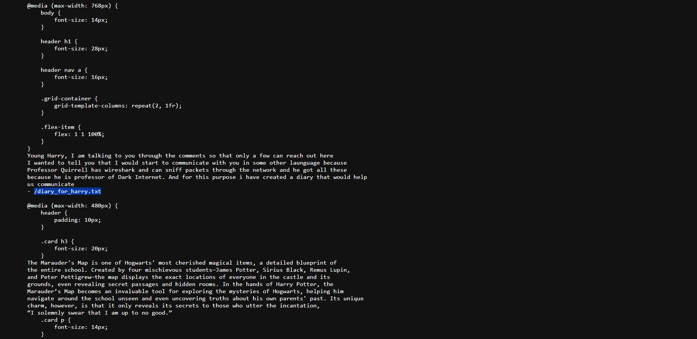

Again here do the view page source and get the file name stored. Here is the catch : The url ends with /Encryption_Master.html and we need to go back a directory and paste the filename that we got. 

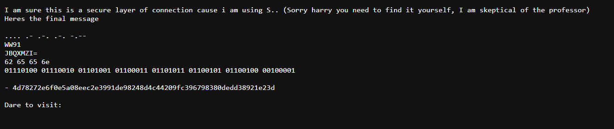
Then decode it using cyberchef to get 
HARRY You Have been tricked! (sequence: Morse Code, Base32, Base64, Hex, Binary) (other than base32 everything cyberchef can decode, You can ask chatgpt for base32)

Now here comes the main part: 4d78272e6f0e5a08eec2e3991de98248d4c44209fc396798380dedd38921e23d
This is SHA256 and we can crack it online using online cracking tool (it was actually sent in the group lmao)
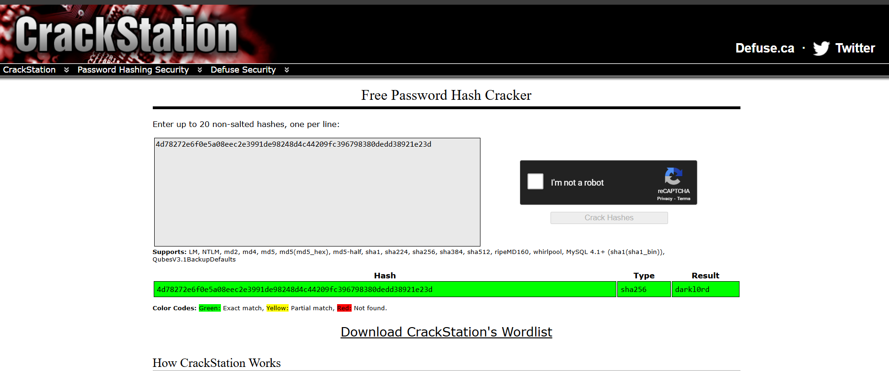

To get the diary written by darkl0rd and that was the flag ;)

## Flag 3:
Now we get a webpage which says that the teacher is new monst.. (could suggest for monster)
If you look at image carefully, its a image of a cookie monster(cartoon OR you could have image search it and found out the name)

Now That we know its something related to cookie and cookies can be manipulated so we start that

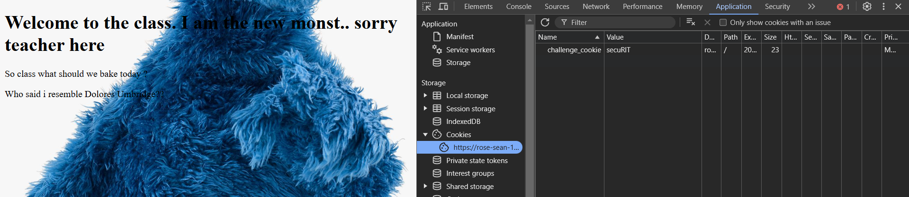

The cookie name clarifies the doubt so now we do some cookie hunting  
We try with value 1 cause mostly we try to put some random value to break the website (fuzzing).  
And we get "Harry, I got some info reagrding the teacher; the teacher always uses his own name for naming cookie what a self-centered guy!!"

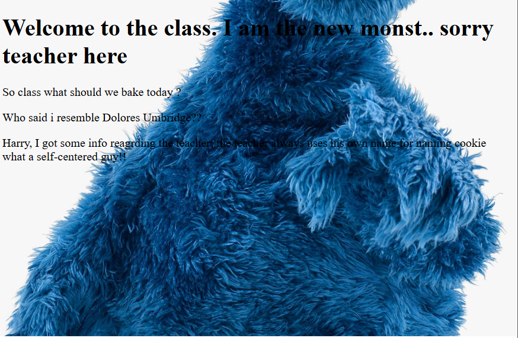

Now here in question it is mentioned that the name of the teacher is in form `lmao_lmao` so it should be `cookie_monster`  
Now we will try that value and get: Wow you figured this out?? But do you have enough patience? Lets see hehe

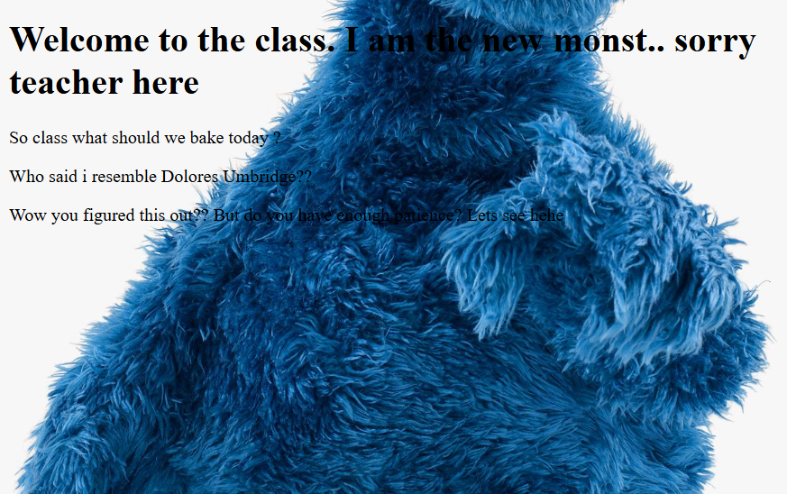

IK the visiblity is a bit odd. Ofc its not because I wanted you to stuggle lmao.

SO yea we now need to keep incrementing the cookie value and finally get the value cookie_monster6

And then we get: Congratulations! Here is your flag:

secuRIT{C00kies_CaN_B3_Dang3rous!}
My cabin now Harry!! -> https://harry-uhqi.onrender.com/login  

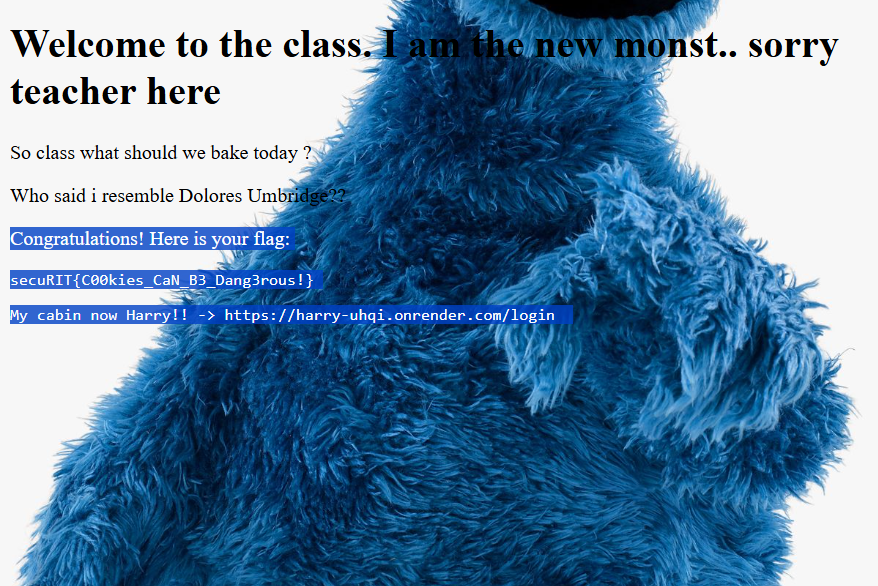

## Flag 4:
Now we use the link and visit that website (it might take some while)
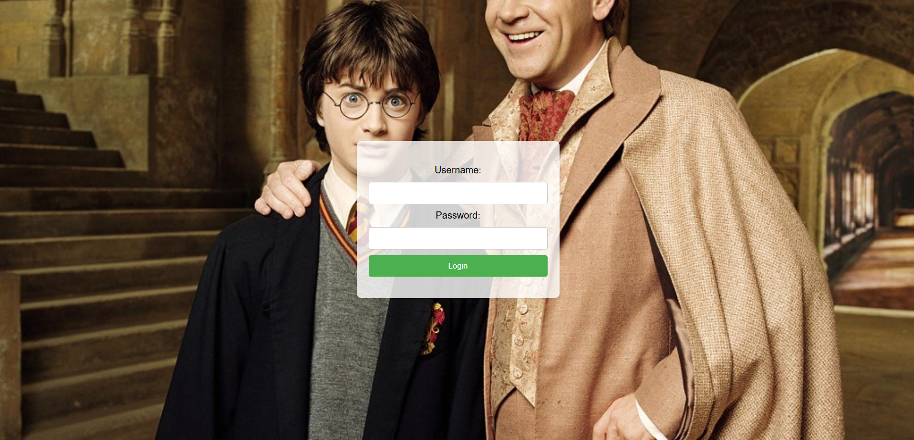

You know who this is?
Now we get a login page and inspect tells us 
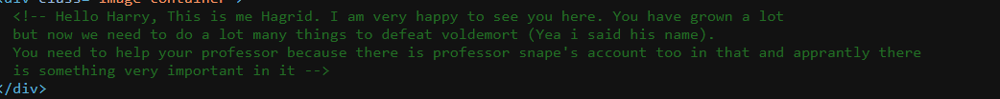

Now here we try to use default creds like admin:admin or admin:password (the point is some developers tend to forget to chaneg the default creds and ofthen become a low hanging fruit. I am sure your wifi default password also isn't changed (hopefully not))

Now we get into the webpage 

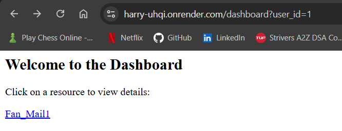

I am not trying to flex that i play chess but look at the URL. We can change the id value and access the restricted pages. 
This is known as IDOR attack https://cheatsheetseries.owasp.org/cheatsheets/Insecure_Direct_Object_Reference_Prevention_Cheat_Sheet.html

Now here are two ways: one you can manipulate user_id or id inside resource database.

We learn to understand about the database working and then how it changes the things, So we change the id to 2 under the resource database.

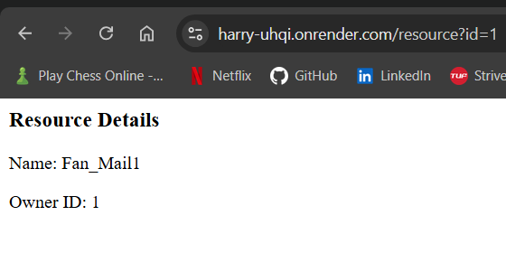

Again no flex ;)

Now we get 

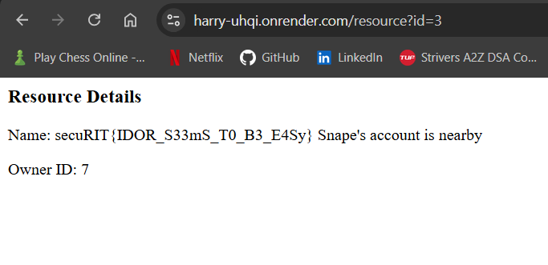

At id=3 but we need snape's account too.

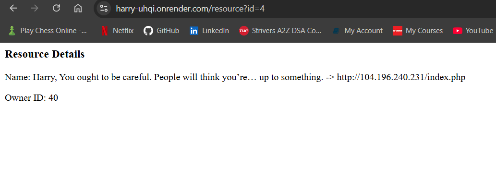

No flex (i should stop this now ig). 

So yea we get the final link and we will visit that now.

## Flag 5:

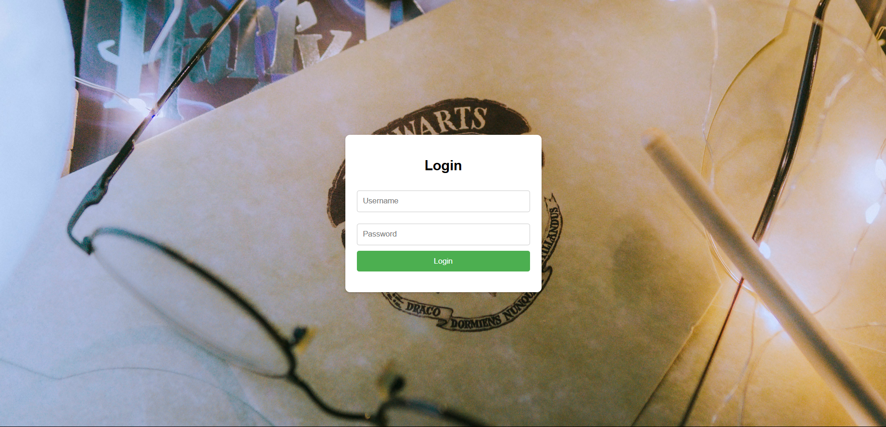

It might say its not secure cause it actually isn't lmao (its because its http and not https  )

Now here again we use admin:admin (cause inspect didnt give anything)
Wow we are logged in and we get:

Welcome, Harry! We got some info from Snape that "darklord"'s last horcrux is stored with him and you need a way to bypass the login page. This is the only hope now, Harry. We believe in you.

Here we can see that darklord is highlighted a lot, possibly a username but we dont know the password what to do ?

SQL injection: https://owasp.org/www-community/attacks/SQL_Injection  
https://youtu.be/2OPVViV-GQk -> YT video

Now that we know aobout SQL injection we use the following creds

username:`darklord`
password:`' OR 1=1-- ` (make sure to keep a space after -- to comment properly)
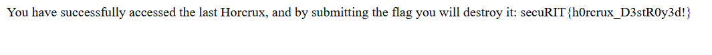

So yea this was it and i hope you learnt something new about web explotation and yea do make sure to start the repo and show support for future event. 
## Made with love by "You Know Who" 💖
